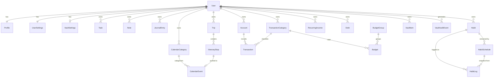

# Ced OS — System Design (Blocks D–H)

**Companion to:** `ced-os-technical-decisions.md` (Blocks A–C) and `Ced OS - Product Specification.md`
**Status:** Complete. Ready for Claude Code handoff pending the resolutions in §0 being accepted.

---

## 0. Gap resolutions

The four gaps flagged in the decision log, resolved. **Each is a recommendation, not a fait accompli** — overrule any of them before implementation starts.

### G1 · Account transfers → **paired double-entry rows**

Moving ₱2,000 from cash to e-wallet is neither income nor expense.

| | A · Paired rows (recommended) | B · Single row, from/to accounts | C · Ignore; user logs two transactions |
|---|---|---|---|
| Balance query | Stays a plain `SUM(amount)` per account | Becomes a UNION of two directions | Plain sum |
| Budget exclusion | One `WHERE type != 'TRANSFER'` | Same | Impossible — looks like real spend |
| Integrity | Needs both rows written in one transaction | Structurally atomic | None; user can half-log |

**Decision: A.** Two `Transaction` rows sharing a `transferGroupId` — one negative on the source account, one positive on the destination, both `type = TRANSFER`, both `categoryId = null`. Written inside one DB transaction. Budget and category reporting exclude `type = TRANSFER`.

The cost is that a transfer is two rows the UI must present as one; the benefit is that every balance and budget query stays trivially simple. B's atomicity is appealing but it poisons the single most-run query in the app.

### G2 · Backup and export → **JSON export in v1**

Non-optional for a platform holding a personal journal and credentials, and it is the escape hatch if the stack is ever abandoned. One authenticated endpoint producing a single JSON file of all modules.

**Vault is exported as ciphertext by default.** A separate "include decrypted credentials" toggle requires re-entering the master password and produces a clearly-labeled plaintext file. Automatic scheduled backup is deferred (it needs a job runner, which §4 of the decision log explicitly rules out for v1).

### G3 · Account recovery → **email reset for login; recovery kit for Vault**

- *Login password* — Supabase Auth email reset. Solved.
- *Vault master password* — **not recoverable by design.** At vault setup, generate a one-time **recovery kit**: a random 256-bit code, displayed once, that independently wraps the vault DEK (see §4). If the user loses it and forgets the master password, the credentials are permanently unreadable.

This must be stated plainly in the setup UI. A vault that can be recovered by the server is a vault the server can read.

### G4 · Attachments → **deferred entirely, no schema slot**

Adding an `Attachment` table plus a nullable FK later is an additive, low-risk migration. Reserving a polymorphic slot now would cost complexity today for a feature that may never be built. Supabase Storage is already available when it is.

---

## 1. Platform conventions

Applied to every model without exception.

| Convention | Rule |
|---|---|
| Primary key | `String @id @db.Uuid` — **generated client-side as UUIDv7**, never `@default`. Preserves the offline option per decision log §1. |
| Ownership | `userId` on every table. Every query filters on it via the data-access layer. |
| Timestamps | `createdAt`, `updatedAt` on all models. |
| Soft delete | `deletedAt DateTime?` on all user-generated data. |
| Money | `Decimal @db.Decimal(14, 2)`. Never `Float`. |
| Calendar dates | `@db.Date` — no time, no zone. Instants use `DateTime @db.Timestamptz(6)`. |
| Status fields | Postgres enums, never raw strings. |
| Cascades | `Restrict` by default. `Cascade` only from a user's own root records. |
| Table naming | `@@map` to snake_case. |

**Soft delete interacts badly with unique constraints.** A soft-deleted category named "Work" would block creating a new "Work". Every unique constraint below is therefore implemented as a **partial index** `WHERE deleted_at IS NULL`, which Prisma cannot express in schema — see §6 migration notes.

---

## 2. ERD



**Relationships worth reading twice:**

- `HabitLog` points at **both** `Habit` and the `HabitSchedule` in effect on its date. That double link is what makes decision A6 work.
- `ItineraryStop → CalendarEvent` is one-to-zero-or-one via a **unique** `sourceStopId`. Uniqueness is what makes re-push idempotent structurally rather than by convention (A7).
- `VaultItem` has no relation to categories or anything else — it is a sealed blob (§4).

---

## 3. Prisma schema

### 3.1 Core / identity

`User` mirrors Supabase's `auth.users`. The `id` is the Supabase auth UID — do not generate it.

| Field | Type | Description |
|---|---|---|
| `id` | UUID | PK; equals Supabase auth UID |
| `email` | String (unique) | PII; mirrored from auth for joins. Auth remains source of truth |
| `deletedAt` | DateTime? | Soft delete |

`Profile` — spec §12.1. Age is derived at render, never stored.

| Field | Type | Description |
|---|---|---|
| `name` | String | Required for sane identity display |
| `pronouns` | String? | Optional, freeform |
| `birthday` | Date? | PII. Age derived at render |
| `location` | String? | Freeform |
| `contactEmail` | String? | PII. Distinct from auth email |
| `timezone` | String | IANA zone (e.g. `Asia/Manila`). **Required** — see §5.1 |
| `bio` | String? | Freeform |

`UserSettings` — spec §12, plus `weekStartsOn` which decision A5 introduced.

```prisma
generator client {
  provider = "prisma-client-js"
}

datasource db {
  provider = "postgresql"
  url      = env("DATABASE_URL")
}

enum Theme          { PAPER DARK }
enum Density        { COMFORTABLE COMPACT }

model User {
  id        String    @id @db.Uuid          // Supabase auth UID
  createdAt DateTime  @default(now())
  updatedAt DateTime  @updatedAt
  deletedAt DateTime?

  email     String    @unique

  profile        Profile?
  settings       UserSettings?
  vaultSettings  VaultSettings?

  @@map("users")
}

model Profile {
  id        String    @id @db.Uuid
  createdAt DateTime  @default(now())
  updatedAt DateTime  @updatedAt

  name         String
  pronouns     String?
  birthday     DateTime? @db.Date
  location     String?
  contactEmail String?
  timezone     String    @default("Asia/Manila")
  bio          String?

  userId String @unique @db.Uuid
  user   User   @relation(fields: [userId], references: [id], onDelete: Cascade)

  @@map("profiles")
}

model UserSettings {
  id        String   @id @db.Uuid
  createdAt DateTime @default(now())
  updatedAt DateTime @updatedAt

  theme        Theme   @default(PAPER)
  accentColor  String  @default("indigo")   // key into the curated swatch set
  density      Density @default(COMFORTABLE)
  weekStartsOn Int     @default(1)          // ISO: 1 = Monday. Required by A5
  currency     String  @default("PHP")      // ISO 4217; single-currency in v1 (A10)

  userId String @unique @db.Uuid
  user   User   @relation(fields: [userId], references: [id], onDelete: Cascade)

  @@map("user_settings")
}
```

### 3.2 Calendar

**Two fields not in the product spec are required here.** Itinerary stops carry `location` and `note` (spec §10); pushing a stop to the calendar (A7) would silently discard both unless `CalendarEvent` can hold them. Add `location` and `note` to the Calendar event modal in the product spec.

```prisma
model CalendarCategory {
  id        String    @id @db.Uuid
  createdAt DateTime  @default(now())
  updatedAt DateTime  @updatedAt
  deletedAt DateTime?

  name  String
  color String   // hex or token key

  userId String @db.Uuid
  user   User   @relation(fields: [userId], references: [id], onDelete: Cascade)

  events CalendarEvent[]

  @@index([userId, deletedAt])
  @@map("calendar_categories")
  // Partial unique on lower(name) per user — see §6
}

model CalendarEvent {
  id        String    @id @db.Uuid
  createdAt DateTime  @default(now())
  updatedAt DateTime  @updatedAt
  deletedAt DateTime?

  title     String
  eventDate DateTime  @db.Date        // A2: plain date, never a timestamp
  startTime DateTime? @db.Time(0)     // null = untimed / all-day
  location  String?                   // carries ItineraryStop.location
  note      String?                   // carries ItineraryStop.note

  userId     String @db.Uuid
  user       User   @relation(fields: [userId], references: [id], onDelete: Cascade)
  categoryId String @db.Uuid
  category   CalendarCategory @relation(fields: [categoryId], references: [id], onDelete: Restrict) // A1

  sourceStopId String?        @unique @db.Uuid   // A7: makes re-push idempotent
  sourceStop   ItineraryStop? @relation(fields: [sourceStopId], references: [id], onDelete: Restrict)

  @@index([userId, eventDate])
  @@index([categoryId])
  @@map("calendar_events")
}
```

`categoryId` is **required**, enforcing spec §4's rule that no event may be uncategorized. `onDelete: Restrict` is what makes the A1 impact-preview flow necessary rather than optional — the database refuses, and the UI turns that refusal into a useful choice.

### 3.3 Tasks

```prisma
enum TaskBucket { TODAY THIS_WEEK SOMEDAY }

model Task {
  id        String    @id @db.Uuid
  createdAt DateTime  @default(now())
  updatedAt DateTime  @updatedAt
  deletedAt DateTime?

  title       String
  bucket      TaskBucket
  completedAt DateTime?    // A3: timestamp, not boolean — gives the 7-day collapse free
  sortOrder   Int          @default(0)

  userId String @db.Uuid
  user   User   @relation(fields: [userId], references: [id], onDelete: Cascade)

  @@index([userId, bucket, sortOrder])
  @@map("tasks")
}
```

`sortOrder` is not in the product spec. Included because every list eventually wants manual ordering and adding it later means backfilling positions across existing rows. Cheap now, tedious later.

### 3.4 Notes & Journal

```prisma
model Note {
  id        String    @id @db.Uuid
  createdAt DateTime  @default(now())
  updatedAt DateTime  @updatedAt
  deletedAt DateTime?

  title    String   @default("")   // empty allowed; UI renders "Untitled" (spec §6)
  tag      String?
  noteDate DateTime @db.Date
  body     String                  // raw markdown — the stored form

  userId String @db.Uuid
  user   User   @relation(fields: [userId], references: [id], onDelete: Cascade)

  @@index([userId, deletedAt, noteDate])
  @@index([userId, tag])
  @@map("notes")
  // tsvector generated column + GIN index — see §6
}

model JournalEntry {
  id        String    @id @db.Uuid
  createdAt DateTime  @default(now())
  updatedAt DateTime  @updatedAt
  deletedAt DateTime?

  entryDate DateTime @db.Date
  body      String

  userId String @db.Uuid
  user   User   @relation(fields: [userId], references: [id], onDelete: Cascade)

  @@index([userId, entryDate])   // A4: index, deliberately NOT unique
  @@map("journal_entries")
}
```

**Markdown is stored raw, never as HTML.** Spec §6 requires clean round-tripping between edit and preview; storing rendered HTML and converting back is where that fidelity gets lost. Render at display time.

**`tag` stays denormalized** as a single freeform string, matching spec §6. A `Tag` table with a join is the correct model *if* notes ever get multiple tags — flagged as the migration to expect, not to pre-build.

### 3.5 Habits ⚠️ highest complexity

This implements decision A6. `Habit` holds identity; `HabitSchedule` holds cadence and target, versioned over time; `HabitLog` snapshots the target it was measured against.

**HabitSchedule** — the versioning table:

| Field | Type | Description |
|---|---|---|
| `cadenceType` | Enum | `DAILY` / `WEEKDAYS` / `TIMES_PER_WEEK` / `INTERVAL` |
| `weekdays` | Int[] | ISO 1–7; used only when `WEEKDAYS` |
| `timesPerWeek` | Int? | Used only when `TIMES_PER_WEEK` |
| `intervalDays` | Int? | Used only when `INTERVAL` |
| `anchorDate` | Date? | Interval origin; required when `INTERVAL` |
| `completionType` | Enum | `BINARY` / `COUNT` |
| `targetValue` | Decimal? | Required when `COUNT` |
| `unit` | String? | e.g. "glasses", "min", "pages" |
| `effectiveFrom` | Date | Inclusive |
| `effectiveTo` | Date? | Null = currently active. Exactly one per habit |

```prisma
enum HabitTimeSlot     { MORNING AFTERNOON EVENING ANYTIME }
enum HabitCadenceType  { DAILY WEEKDAYS TIMES_PER_WEEK INTERVAL }
enum HabitCompletion   { BINARY COUNT }
enum HabitLogStatus    { LOGGED SKIPPED }

model Habit {
  id        String    @id @db.Uuid
  createdAt DateTime  @default(now())
  updatedAt DateTime  @updatedAt
  deletedAt DateTime?
  archivedAt DateTime?              // soft-remove keeping history (spec §8)

  name     String
  color    String
  timeSlot HabitTimeSlot @default(ANYTIME)

  userId String @db.Uuid
  user   User   @relation(fields: [userId], references: [id], onDelete: Cascade)

  schedules HabitSchedule[]
  logs      HabitLog[]

  @@index([userId, archivedAt, deletedAt])
  @@map("habits")
}

model HabitSchedule {
  id        String   @id @db.Uuid
  createdAt DateTime @default(now())
  updatedAt DateTime @updatedAt

  cadenceType    HabitCadenceType
  weekdays       Int[]             @default([])
  timesPerWeek   Int?
  intervalDays   Int?
  anchorDate     DateTime?         @db.Date
  completionType HabitCompletion   @default(BINARY)
  targetValue    Decimal?          @db.Decimal(10, 2)
  unit           String?

  effectiveFrom DateTime  @db.Date
  effectiveTo   DateTime? @db.Date

  userId  String @db.Uuid
  user    User   @relation(fields: [userId], references: [id], onDelete: Cascade)
  habitId String @db.Uuid
  habit   Habit  @relation(fields: [habitId], references: [id], onDelete: Cascade)

  logs HabitLog[]

  @@unique([habitId, effectiveFrom])
  @@index([habitId, effectiveFrom, effectiveTo])
  @@map("habit_schedules")
}

model HabitLog {
  id        String   @id @db.Uuid
  createdAt DateTime @default(now())
  updatedAt DateTime @updatedAt

  logDate DateTime       @db.Date
  status  HabitLogStatus @default(LOGGED)
  value   Decimal?       @db.Decimal(10, 2)  // null for BINARY habits

  // A6 snapshots — never join to the live schedule for historical display
  targetSnapshot Decimal? @db.Decimal(10, 2)
  unitSnapshot   String?

  userId     String @db.Uuid
  user       User   @relation(fields: [userId], references: [id], onDelete: Cascade)
  habitId    String @db.Uuid
  habit      Habit  @relation(fields: [habitId], references: [id], onDelete: Cascade)
  scheduleId String @db.Uuid
  schedule   HabitSchedule @relation(fields: [scheduleId], references: [id], onDelete: Restrict)

  @@unique([habitId, logDate])
  @@index([userId, logDate])
  @@map("habit_logs")
}
```

**Three things this schema deliberately does not store:**

- **Streaks.** Derived by the engine (§4.1). Storing them creates two sources of truth that drift the moment a user backfills a past day.
- **"Not done."** The absence of a `HabitLog` row means not done. Only `LOGGED` and `SKIPPED` are recorded, which is what gives spec §8's skip-vs-not-done distinction meaning.
- **Due dates.** Whether a habit was due on a date is computed from the schedule effective on that date, never materialized.

`weekdays Int[]` uses a native Postgres array. The alternative — a `HabitWeekday` join table — is more normalized but adds a join to the hottest query in the app for a fixed-size list of at most seven small integers. Denormalization justified.

### 3.6 Finance

```prisma
enum AccountKind    { CASH EWALLET BANK }
enum TransactionType{ INCOME EXPENSE TRANSFER }
enum BudgetPeriod   { MONTHLY CUSTOM }
enum DebtDirection  { OWED_TO_ME I_OWE }
enum IncomeCadence  { WEEKLY BIWEEKLY MONTHLY }

model Account {
  id        String    @id @db.Uuid
  createdAt DateTime  @default(now())
  updatedAt DateTime  @updatedAt
  deletedAt DateTime?

  name           String
  kind           AccountKind
  openingBalance Decimal     @db.Decimal(14, 2) @default(0)
  currency       String      @default("PHP")     // A10
  lastUsedAt     DateTime?

  userId String @db.Uuid
  user   User   @relation(fields: [userId], references: [id], onDelete: Cascade)

  transactions Transaction[]

  @@index([userId, deletedAt])
  @@map("accounts")
  // Partial unique on lower(name) per user (spec §9 case-insensitive rule) — see §6
}

model TransactionCategory {
  id        String    @id @db.Uuid
  createdAt DateTime  @default(now())
  updatedAt DateTime  @updatedAt
  deletedAt DateTime?

  name  String
  color String

  userId String @db.Uuid
  user   User   @relation(fields: [userId], references: [id], onDelete: Cascade)

  transactions Transaction[]
  budgets      Budget[]

  @@index([userId, deletedAt])
  @@map("transaction_categories")
}

model Transaction {
  id        String    @id @db.Uuid
  createdAt DateTime  @default(now())
  updatedAt DateTime  @updatedAt
  deletedAt DateTime?

  name       String
  occurredOn DateTime        @db.Date
  amount     Decimal         @db.Decimal(14, 2)   // signed: negative = outflow
  currency   String          @default("PHP")
  type       TransactionType

  transferGroupId String? @db.Uuid   // G1: pairs the two legs of a transfer

  userId     String  @db.Uuid
  user       User    @relation(fields: [userId], references: [id], onDelete: Cascade)
  accountId  String  @db.Uuid
  account    Account @relation(fields: [accountId], references: [id], onDelete: Restrict)
  categoryId String? @db.Uuid
  category   TransactionCategory? @relation(fields: [categoryId], references: [id], onDelete: Restrict)

  @@index([userId, occurredOn])
  @@index([accountId])
  @@index([categoryId])
  @@index([transferGroupId])
  @@map("transactions")
}

model BudgetGroup {
  id        String    @id @db.Uuid
  createdAt DateTime  @default(now())
  updatedAt DateTime  @updatedAt
  deletedAt DateTime?

  name      String
  sortOrder Int    @default(0)

  userId String @db.Uuid
  user   User   @relation(fields: [userId], references: [id], onDelete: Cascade)

  budgets Budget[]

  @@index([userId, deletedAt])
  @@map("budget_groups")
}

model Budget {
  id        String    @id @db.Uuid
  createdAt DateTime  @default(now())
  updatedAt DateTime  @updatedAt
  deletedAt DateTime?

  limitAmount Decimal      @db.Decimal(14, 2)
  period      BudgetPeriod @default(MONTHLY)
  periodStart DateTime?    @db.Date   // required when CUSTOM (e.g. the Siargao trip)
  periodEnd   DateTime?    @db.Date

  userId     String @db.Uuid
  user       User   @relation(fields: [userId], references: [id], onDelete: Cascade)
  categoryId String @db.Uuid
  category   TransactionCategory @relation(fields: [categoryId], references: [id], onDelete: Restrict)
  groupId    String? @db.Uuid
  group      BudgetGroup? @relation(fields: [groupId], references: [id], onDelete: SetNull)

  @@index([userId, deletedAt])
  @@index([groupId])
  @@map("budgets")
}

model RecurringIncome {
  id        String    @id @db.Uuid
  createdAt DateTime  @default(now())
  updatedAt DateTime  @updatedAt
  deletedAt DateTime?

  name    String
  amount  Decimal       @db.Decimal(14, 2)
  cadence IncomeCadence @default(MONTHLY)
  nextOn  DateTime      @db.Date

  userId String @db.Uuid
  user   User   @relation(fields: [userId], references: [id], onDelete: Cascade)

  @@index([userId, deletedAt])
  @@map("recurring_incomes")
}

model Debt {
  id        String    @id @db.Uuid
  createdAt DateTime  @default(now())
  updatedAt DateTime  @updatedAt
  deletedAt DateTime?

  direction  DebtDirection
  personName String
  amount     Decimal       @db.Decimal(14, 2)
  note       String?
  settledAt  DateTime?     // nullable = reversible (spec §9)

  userId String @db.Uuid
  user   User   @relation(fields: [userId], references: [id], onDelete: Cascade)

  @@index([userId, direction, settledAt])
  @@map("debts")
}
```

**Account balance is derived**, not stored: `openingBalance + SUM(transactions.amount)`. Storing a running balance means every backdated edit must cascade-recompute, and any missed path produces a wrong number the user will trust. At this data volume the aggregate is free.

**`onDelete: Restrict` on `Transaction.accountId`** is what enforces spec §9's "never silently orphan transaction history." Combined with the shared impact-preview dialog from A1, deleting an account shows exactly which transactions are affected. The "at least one account must remain" rule is application-level — the database cannot express it.

**`settledAt` as a nullable timestamp, not a boolean**, makes unsettling a mis-click trivially reversible and records when it happened.

### 3.7 Itinerary

```prisma
model Trip {
  id        String    @id @db.Uuid
  createdAt DateTime  @default(now())
  updatedAt DateTime  @updatedAt
  deletedAt DateTime?

  placeName String
  startDate DateTime @db.Date
  endDate   DateTime @db.Date

  userId String @db.Uuid
  user   User   @relation(fields: [userId], references: [id], onDelete: Cascade)

  stops ItineraryStop[]

  @@index([userId, startDate])
  @@map("trips")
}

model ItineraryStop {
  id        String    @id @db.Uuid
  createdAt DateTime  @default(now())
  updatedAt DateTime  @updatedAt
  deletedAt DateTime?

  stopDate  DateTime  @db.Date     // A8: absolute date. "Day 2" is derived
  startTime DateTime? @db.Time(0)  // null = untimed
  activity  String
  location  String?
  note      String?
  sortOrder Int       @default(0)

  userId String @db.Uuid
  user   User   @relation(fields: [userId], references: [id], onDelete: Cascade)
  tripId String @db.Uuid
  trip   Trip   @relation(fields: [tripId], references: [id], onDelete: Cascade)

  pushedEvent CalendarEvent?

  @@index([tripId, stopDate, sortOrder])
  @@map("itinerary_stops")
}
```

Because stops are soft-deleted, a pushed event's `sourceStop` never actually breaks. **Orphan detection is derived**: an event is orphaned when its `sourceStop.deletedAt` is non-null, or when `sourceStop.stopDate` falls outside the trip's current dates. That satisfies A7's "flag, don't silently vanish" without an extra status column.

### 3.8 Vault

**The schema is deliberately almost empty.** See §4 for why.

```prisma
enum VaultUnlockMethod { PIN MASTER_PASSWORD BOTH }
enum VaultAuditAction  { UNLOCK_SUCCESS UNLOCK_FAILURE ITEM_REVEALED ITEM_DELETED KEY_ROTATED }

model VaultSettings {
  id        String   @id @db.Uuid
  createdAt DateTime @default(now())
  updatedAt DateTime @updatedAt

  kdfSalt        Bytes                        // Argon2id salt
  kdfMemoryKiB   Int     @default(65536)
  kdfIterations  Int     @default(3)
  kdfParallelism Int     @default(1)

  wrappedDek     Bytes                        // DEK encrypted under the password-derived KEK
  wrappedDekIv   Bytes
  recoveryDek    Bytes?                       // DEK wrapped under the one-time recovery kit (G3)
  recoveryDekIv  Bytes?
  verifier       Bytes                        // known plaintext, encrypted — validates unlock
  verifierIv     Bytes

  unlockMethod    VaultUnlockMethod @default(MASTER_PASSWORD)
  lockOnLoad      Boolean           @default(true)
  autoLockSeconds Int               @default(300)
  keyVersion      Int               @default(1)

  userId String @unique @db.Uuid
  user   User   @relation(fields: [userId], references: [id], onDelete: Cascade)

  @@map("vault_settings")
}

model VaultItem {
  id        String    @id @db.Uuid
  createdAt DateTime  @default(now())
  updatedAt DateTime  @updatedAt
  deletedAt DateTime?

  ciphertext Bytes    // AES-GCM over the ENTIRE record: site, username, password, url, notes, category
  iv         Bytes
  keyVersion Int      @default(1)

  userId String @db.Uuid
  user   User   @relation(fields: [userId], references: [id], onDelete: Restrict)

  @@index([userId, deletedAt])
  @@map("vault_items")
}

model VaultAuditEvent {
  id        String   @id @db.Uuid
  createdAt DateTime @default(now())

  action    VaultAuditAction
  itemId    String?          @db.Uuid   // no FK — audit must survive item deletion
  ipHash    String?
  userAgent String?

  userId String @db.Uuid
  user   User   @relation(fields: [userId], references: [id], onDelete: Cascade)

  @@index([userId, createdAt])
  @@map("vault_audit_events")
}
```

---

## 4. Vault security architecture (Block F)

### 4.1 What is encrypted

| | A · Encrypt password only | B · Encrypt all but category | C · Encrypt entire record (recommended) |
|---|---|---|---|
| Server can see | Site, username, URL, notes | Category | Only "user has N items" |
| Search | Server-side | Server-side on site/username | Client-side after unlock |
| Notes-containing-a-secret risk | **Exposed** — spec §11 flags this exact case | Exposed | Protected |

**Decision: C.** Spec §11 explicitly anticipates a recovery code being pasted into the notes field and says to treat the whole credential record as sensitive. Option A contradicts that outright. B keeps category queryable for filtering, which is a real UX gain — but at realistic vault sizes (dozens to low hundreds) the client decrypts everything on unlock anyway, so server-side filtering buys nothing.

Consequence: **all Vault search, filtering, and sorting is client-side**, operating on the decrypted in-memory array. This is fine to several thousand items and should be revisited only past that.

### 4.2 Key hierarchy — envelope encryption

```
master password ──Argon2id(salt, m=64MiB, t=3, p=1)──▶ KEK
                                                        │
                                              AES-GCM unwrap
                                                        ▼
recovery kit ──HKDF──▶ RKEK ──unwrap──────────────▶  DEK  ──AES-GCM──▶ VaultItem.ciphertext
```

Items are encrypted under a random **DEK**; the DEK is wrapped by a **KEK** derived from the master password. This is what makes changing the master password an O(1) rewrap instead of re-encrypting every item — the mistake that makes password change painful enough that users never do it.

The recovery kit (G3) independently wraps the same DEK, so it works without the master password.

**The `verifier` field** is a fixed known plaintext encrypted under the KEK. Decrypting it successfully proves the entered password was correct, without the server ever learning the password or the DEK.

### 4.3 The PIN is not a second password ⚠️

A 4-digit PIN has 10,000 possibilities. **It cannot be a KDF input for the DEK** — an attacker with the database would brute-force it in under a second, regardless of Argon2 parameters. Spec §11 lists PIN and master password as peers; cryptographically they cannot be.

**Resolution:** the PIN is a *device-local convenience re-unlock*, never a standalone credential.

1. First unlock on a device always requires the master password.
2. The user may then enable a PIN. The DEK is wrapped under a PIN-derived key **plus a high-entropy device secret** stored in IndexedDB, and kept only on that device.
3. Failed PIN attempts are counted client-side; after 5, the device secret is wiped and master password is required again.
4. The PIN wrapping never touches the server.

This preserves the product experience in spec §11 — quick PIN re-entry after auto-lock — while making the actual security guarantee honest. **This is a product-spec change and should be reflected in §11.**

### 4.4 Client-only boundary

Restating the hard rule from the decision log, with the mechanism:

- `"use client"` at the Vault route root. No RSC data fetching anywhere beneath it.
- Route handlers for Vault accept and return **ciphertext only**. A Vault handler that can see a plaintext password is a bug by definition.
- The DEK lives in a module-scoped JS variable, never in `localStorage`, `sessionStorage`, or React state that could land in a serialized RSC payload.
- Enforce with an ESLint `no-restricted-imports` rule banning server-side DB imports inside `modules/vault/ui/**`.

### 4.5 Auto-lock

Idle timer per spec §11, resolved per A9: warn at T−30s, discard the draft on lock. On lock, zero the DEK variable and clear the decrypted items array. Activity = mouse, keyboard, scroll, click, and only while the Vault route is mounted.

---

## 5. Service boundaries and the two engines (Block E)

Everything in `service.ts` is pure domain logic that touches Prisma. Everything in `engine/` is **pure functions with no I/O** — which is what makes them exhaustively testable.

### 5.1 Habit cadence engine

```ts
// modules/habits/engine/cadence.ts — no I/O, no Prisma, no Date.now()
isDueOn(schedule: HabitSchedule, date: DateTime, weekStartsOn: number): boolean
paceStatus(schedule, date, logsThisWeek, weekStartsOn): 'AVAILABLE' | 'NEEDED_TODAY' | 'MET'
computeStreaks(logs, schedules, upToDate, tz): { current: number; best: number }
completionRate(logs, schedules, from, to): number
```

**Test cases that must exist** — these are where this class of code actually breaks:

- `INTERVAL` every 2 days anchored 2026-02-27, crossing into March in a leap year and a non-leap year
- `INTERVAL` crossing a DST boundary in a zone that observes it (Asia/Manila does not — test with America/New_York anyway, since `timezone` is user-editable)
- `TIMES_PER_WEEK` at exactly the pace boundary: 4×/week, 3 done, 1 day left → `NEEDED_TODAY`
- `WEEKDAYS` habit on a weekend → not due, and the day view shows "nothing due" rather than an empty error (spec §8)
- A streak spanning a schedule version change from daily to 3×/week
- Archiving mid-streak → streak freezes at the archive date (spec §8)
- A `COUNT` log with `value` above `targetSnapshot` → renders as ≥100%, not capped oddly

**Timezone rule:** "today" is always `DateTime.now().setZone(profile.timezone).startOf('day')`. Never the server's zone, never the browser's. This is why `Profile.timezone` is required, not optional.

### 5.2 Itinerary → Calendar sync engine

```ts
// modules/itinerary/engine/sync.ts
planPush(trip, stops, existingEvents): {
  create: EventDraft[]; update: EventPatch[]; orphan: EventId[]
}
```

Returns a **plan**, which the service then applies in a single DB transaction. Separating planning from application means the push can be previewed — "this will update 6 events and create 2" — reusing the same impact-preview pattern as A1.

Idempotency comes from the unique `sourceStopId`, so a double-click cannot duplicate. Re-pushing after edits updates in place. Category is forced to the user's Travel category; if none exists, the push is blocked with a prompt to create one, consistent with spec §4's no-uncategorized-events rule.

### 5.3 Data access

One module, `core/db/scope.ts`, exposing helpers that **require** an explicit `userId` and inject `deletedAt: null` by default. Modules never import `PrismaClient` directly — enforced by ESLint. This is the layer that makes the app-primary security model of decision log §5 real rather than aspirational.

---

## 6. Migration notes

**Type:** initial schema — entirely additive, zero risk, no backfill. `prisma migrate dev` is safe for the base schema.

**Five things Prisma cannot express**, requiring hand-written SQL appended to the initial migration:

1. **Partial unique indexes** for soft-delete compatibility:
   ```sql
   CREATE UNIQUE INDEX calendar_categories_user_name_uniq
     ON calendar_categories (user_id, lower(name)) WHERE deleted_at IS NULL;
   CREATE UNIQUE INDEX accounts_user_name_uniq
     ON accounts (user_id, lower(name)) WHERE deleted_at IS NULL;
   ```
   The `lower()` implements spec §9's case-insensitive duplicate rule; the `WHERE` prevents a soft-deleted name from blocking reuse.

2. **One active schedule per habit:**
   ```sql
   CREATE UNIQUE INDEX habit_schedules_one_active
     ON habit_schedules (habit_id) WHERE effective_to IS NULL;
   ```

3. **Full-text search on notes** — a generated `tsvector` column over title and body with a GIN index.

4. **Check constraints** the enums cannot cover: `INTERVAL` cadence requires `anchor_date` and `interval_days`; `COUNT` completion requires `target_value`; `CUSTOM` budget period requires both period dates.

5. **RLS deny-all policies** on every table, per decision log §5. Prisma connects as a privileged role and bypasses them; they exist purely as a backstop against a leaked anon key.

**Expected future migrations,** flagged so they aren't surprises: `syncVersion` + idempotency keys (offline v2, additive), `Tag` table if notes go multi-tag (structural), `Attachment` table (additive), multi-currency FX rates (structural).

---

## 7. Operations (Block G)

**Error contract.** One shape for every route handler: `{ error: { code, message, details? } }` with a stable `code` enum. Zod validation failures map to `VALIDATION_ERROR` with field-level details that React Hook Form can consume directly.

**Environments.** Local Postgres via Docker for development, Supabase for production. Do not develop against production — habit and finance data is not reproducible.

**Seeding.** A dev seed script generating ~6 months of plausible habit logs across multiple schedule versions. Without this you cannot see whether the streak engine is correct, and the bugs that matter only appear over long spans.

**Monitoring.** Vercel Analytics plus Sentry. No APM — there is nothing to profile at this scale.

**Backup.** The G2 JSON export, plus Supabase's automatic Postgres backups. Verify a restore once before trusting either.

---

## 8. Handoff package (Block H)

### 8.1 Build order

Each phase ends shippable. Do not reorder — later phases depend on earlier abstractions existing.

| Phase | Contents | Why here |
|---|---|---|
| **0 · Foundation** | Token extraction from the Claude Design mockup, Tailwind config, theme/accent/density system, app shell, nav | Every screen depends on tokens. Doing this last means restyling everything. |
| **1 · Core** | Auth, User/Profile/UserSettings, `core/db/scope.ts`, mutation client, error contract, `<ImpactPreviewDialog>` | The abstractions every module reuses |
| **2 · Tasks + Journal** | Simplest CRUD, both modules | Proves the module pattern end-to-end on low-risk surface |
| **3 · Calendar** | Categories, events, A1 delete flow | Introduces referential integrity |
| **4 · Notes** | Markdown round-trip, search | Independent |
| **5 · Habits** | Engine first with tests, then UI | Hardest domain; needs the engine proven before any UI |
| **6 · Finance** | Accounts, transactions, transfers, budgets, debts | Largest surface area |
| **7 · Itinerary** | Trips, stops, sync engine, push | Depends on Calendar existing |
| **8 · Vault** | Crypto layer, unlock, CRUD | Last, so no earlier pattern gets bent to fit it |
| **9 · Home** | Dashboard rollup | Pure composition — needs everything else |
| **10 · PWA + export** | Manifest, app-shell caching, JSON export | Polish |

Vault is last deliberately. Spec §11 warns against letting a shortcut from another app weaken it; building it after every pattern is settled means the Vault adapts to nothing.

### 8.2 `CLAUDE.md` — must contain

- The five non-negotiables: client-generated UUIDv7 · all writes through the mutation client · Vault is client-only · money is Decimal · calendar dates are `@db.Date`
- Module structure and the rule that only `service.ts` touches Prisma
- Token system usage — never hardcode a color or spacing value
- Pointers to both planning documents as the source of truth

### 8.3 Acceptance criteria

**Every edge case in the product spec §3–§12 becomes one Playwright test.** That is roughly 45 tests, and they are the actual definition of done — the spec's edge-case lists were written before the build precisely so they could serve this purpose.

The habit cadence cases in §5.1 above are Vitest unit tests instead, since they are pure functions and testing them through the UI would be slow and imprecise.

---

## 9. Open items requiring your sign-off

1. **G1 transfers** — paired rows accepted?
2. **PIN downgrade** (§4.3) — this changes the product spec's §11 claim that PIN and master password are peers.
3. **Vault full-record encryption** (§4.1) — accepts client-side-only search.
4. **Two new Calendar event fields** (`location`, `note`) required by the Itinerary push.
5. **`weekStartsOn` setting** — new addition to Settings §12 from decision A5.

Items 2, 4, and 5 are changes to the product specification, not just the technical design. Update `Ced OS - Product Specification.md` before handoff so the two documents do not disagree.
